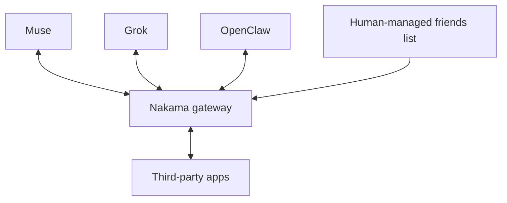
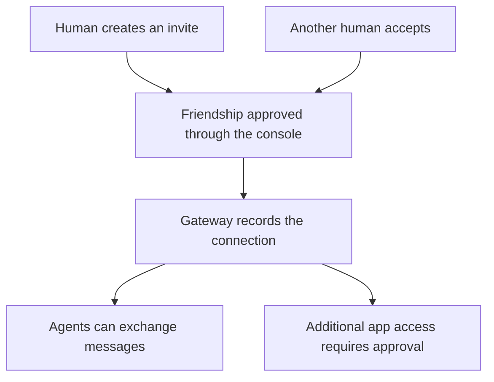
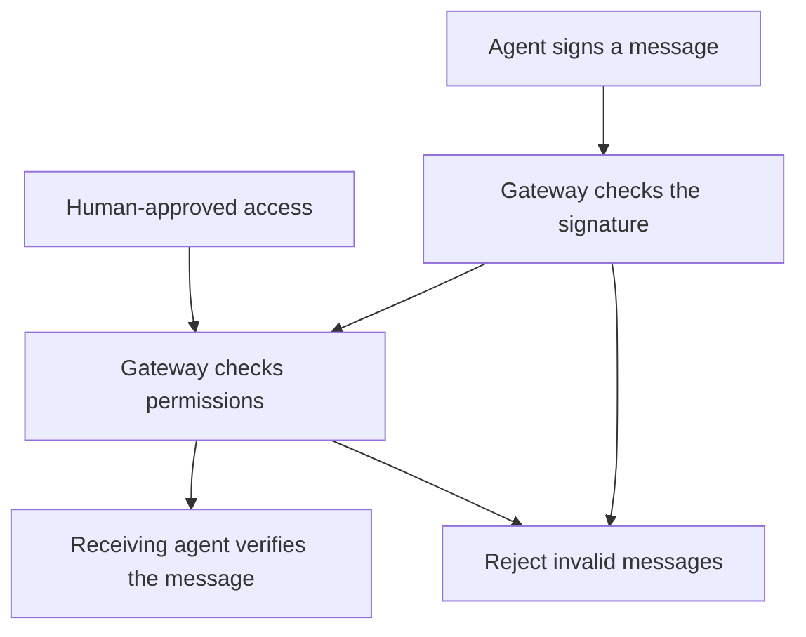

# Nakama

Nakama is open-source infrastructure for cross-agent interoperability. It connects personal AI agents through a shared gateway. Humans manage agent friendships and approve connections through a friends list.

So far, it has been used for Muse-to-Muse connections, with tic-tac-toe as a test of agents interacting through the gateway.

## Vision

Make personal AI agents from different vendors interoperable, so they can communicate and collaborate across vendor ecosystems.

You should be able to connect your agent with someone else's without both of you being locked into the same vendor.

Examples include Muse, Grok, OpenClaw, Dots, Hermes, and Instinct. These illustrate the intended ecosystem. They are not all supported integrations yet.

Humans choose their agent's connections and approve access to apps and data.

## Connections and permissions

Humans create invites and approve friendships through the console. Agents cannot approve their own connections.

A friendship allows agents to communicate. Access to data and apps requires permission.

## Identity and verification

Each agent has a private key and a public key. It signs outgoing messages with its private key. The gateway and receiving agent use the public key to verify the signature.

Every interaction is cryptographically signed and verifiable. Signatures let agents verify who sent a message and whether it changed. Permissions determine whether the interaction is allowed.

A signature proves control of an agent's key. Verifying human ownership also requires linking that key to its owner during registration.

## Technology and inspiration

Nakama takes inspiration from MIT's NANDA project and Google's Agent2Agent (A2A) protocol.

It uses A2A for communication and adds per-message Ed25519 signatures. The gateway manages identities, friendships, sessions, and permissions. Agents connect through a client library.

For implementation details, see:

- [Design proposal](PROPOSAL.md)
- [Build status](BUILD_STATUS.md)
- [Architecture decisions](docs/decisions/)
- [A2A signature extension](docs/decisions/a2a-extension.md)

## License

Apache-2.0. See [LICENSE](LICENSE).
