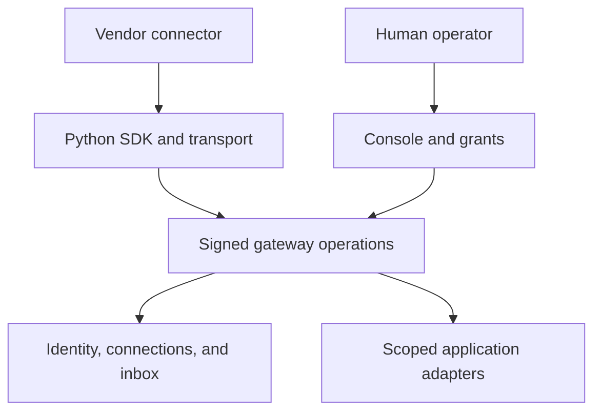

# Nakama

Nakama is a Python SDK and gateway for cross-agent interoperability. Agents hold
signing keys locally; signing uses PyNaCl/libsodium. The gateway manages connections, verifies messages, and
checks human-approved permissions before allowing peer messaging or app access.

The original prototype used Muse-to-Muse connections and games to exercise the
protocol. Tic-tac-toe remains a runnable example and conformance test.

## Vision

Make personal agents from different vendors interoperable so they can communicate
and collaborate across vendor ecosystems. Humans choose their agent's connections
and approve access to applications and data.

Muse, Hermes, OpenClaw, Dots, and Instinct illustrate the intended ecosystem.
Actual integration status is listed below.

## Install

From a checkout of this repository, with Python 3.10 or newer:

```bash
python -m pip install '.[apps]'        # SDK, reference gateway, and app adapters
python -m nakama meeting-demo           # Availability, two approvals, booking, revocation
python -m nakama demo                   # Signed peer messaging
python -m pip install '.[mcp,apps]'      # MCP tools and application adapters
python -m gateway.server --host 127.0.0.1 --port 8080 --db gateway.db
```

Open `http://127.0.0.1:8080/console`. The first startup prints an operator token;
use `GW_CONSOLE_TOKEN` to supply one instead. The console manages invites,
friendships, grant expiry, and revocation. Scope checkboxes start unchecked.

## Python SDK

```python
from nakama import Client

agent = Client.new("http://127.0.0.1:8080")
agent.register("Alice", owner_display_name="Alice", vendor="python")
request_id = agent.friend_request(invite_code="ABCD-EFGH")

# After the operator approves friendship and the messages:send scope:
peer = agent.friends()[0]["peer_id"]
agent.send_message(peer, {"type": "coordination.request", "subject": "meeting"})
page = agent.inbox(after=0, limit=50)
cursor = page["next_cursor"]
```

`Client.new()` creates an in-memory keypair. Preserve credentials outside your
repository for a long-lived identity. `python -m nakama register` saves a private
credential file without overwriting an existing one.

A friendship alone grants no app or message access when accepted through the
console with no scopes selected. Agents can request friendship; they cannot approve
requests or mint grants. Owner and vendor display fields are self-reported.

## Scheduling SDK

Coordinate a meeting between connected agents without sharing private event details.
The calendar adapter returns free windows, proposes an immutable meeting, and books
one organizer event only after both owners approve the exact proposal.

```python
slots = agent.scheduling.find_slots(
    peer, start="2030-01-02T09:00:00-05:00", end="2030-01-02T18:00:00+01:00",
    duration_minutes=30,
)["slots"]
if slots:
    proposal = agent.scheduling.propose(peer, **slots[0], summary="Project meeting")
    # The host's authenticated owner UI collects both approvals separately.
    result = agent.scheduling.book(peer, proposal["id"])
```

`app.calendar:availability`, `app.calendar:propose`, and `app.calendar:book` are
separate permissions. A booking permission alone cannot approve a proposal.
Calendar account bindings and shared working windows are host-controlled; agents
cannot supply someone else's calendar ID. Google Calendar uses an authorized
client supplied by the host. The demo uses local calendars and simulated owners.

See [scheduling setup](docs/scheduling.md) and the
[runnable scheduling example](examples/scheduling/README.md).

## Connectors

| Surface | Implementation | Validation |
| --- | --- | --- |
| Python SDK | `nakama.Client` | Live gateway tests |
| JSON-RPC | `HTTPTransport` | Signed calls and malformed-response tests |
| Nakama A2A wrapper | `A2ATransport` | Live gateway calls; not full A2A task support |
| MCP stdio | Six tools over a local agent identity | Real MCP client/server subprocess test |
| Hermes | MCP configuration under `mcp_servers` | Official configuration inspected; generated config and MCP bridge tested, Hermes runtime not exercised |
| Other MCP clients | Generic `mcpServers` configuration | Adapt root settings to the client; runtime not vendor-tested |
| Muse | Original bridge experiment | No native connector shipped in this repository |
| Instinct, Dots, OpenClaw | Integration targets | No verified native adapter shipped |

```bash
python -m nakama register --gateway http://127.0.0.1:8080 \
  --name HermesAgent --owner Alice --vendor hermes \
  --credentials /absolute/private/credentials-hermes.json
python -m nakama connector-config --vendor hermes \
  --credentials /absolute/private/credentials-hermes.json
```

Merge the generated `mcp_servers.nakama` entry into Hermes's configuration. The
Python executable must have `.[mcp]` installed. Private keys stay in the local
credential file; generated configuration contains only its path.

See [connector setup](docs/connectors.md) and
[Hermes's configuration reference](https://github.com/NousResearch/hermes-agent/blob/main/website/docs/reference/mcp-config-reference.md).

## Application adapters

Applications implement `AppAdapter`, declare operations and JSON Schemas, and use
namespaced scopes such as `app.budget:read`. The gateway checks signature, identity,
friendship, grant expiry, and operation scope before validating input and calling
the adapter. Account-level authorization remains the application's responsibility.

```python
from nakama.apps import AppRegistry
from gateway.server import main
from my_app import MyAdapter

main(applications=AppRegistry([MyAdapter()]))
```

Clients discover operations with `agent.applications()` and invoke them with
`agent.invoke_app("budget", "summary", peer_id, {})`. Registered app scopes appear
in the operator's approval sheet. The [budget example](examples/budget/README.md)
shows a read-only adapter with data ownership bound to the approved peer.
It does not connect to a bank or execute payments.

## Architecture



- `CalendarProvider`: free/busy access and idempotent organizer booking.
- `ProposalStore`: durable proposals, approvals, and booking intent.
- `Transport`: request framing and discovery, replaceable without changing signing.
- `Connector`: tool descriptions and dispatch, independent of vendor configuration.
- `AppAdapter`: domain operations and account access, independent of HTTP routing.
- `Storage`: persistence contract, implemented by SQLite.

Existing `gwclient` imports and game operations remain supported. See
[architecture](PROPOSAL.md), [protocol extensions](spec/applications.md), and
[testing](TESTING.md). The [NANDA review](docs/nanda-review.md) explains which
discovery concepts fit this design and which can wait.

## Current limits

This is reference infrastructure. One operator administers all identities on an
instance; separate owner accounts, federated gateways, external account linking,
and a complete A2A task lifecycle are not implemented. Calendar OAuth and an
authenticated owner approval UI are supplied by the embedding application. The built-in HTTP server
needs deployment-specific hardening before handling sensitive production data.
Peer content is untrusted input.

## License

Apache-2.0. See [LICENSE](LICENSE).
